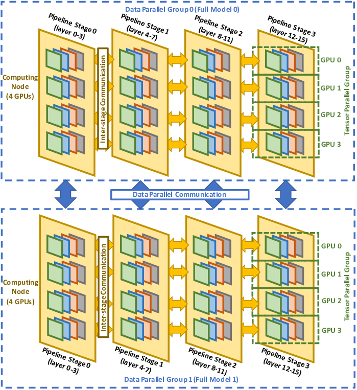
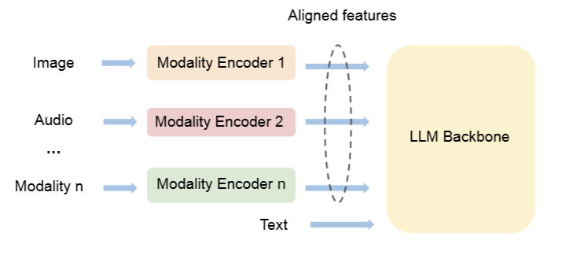
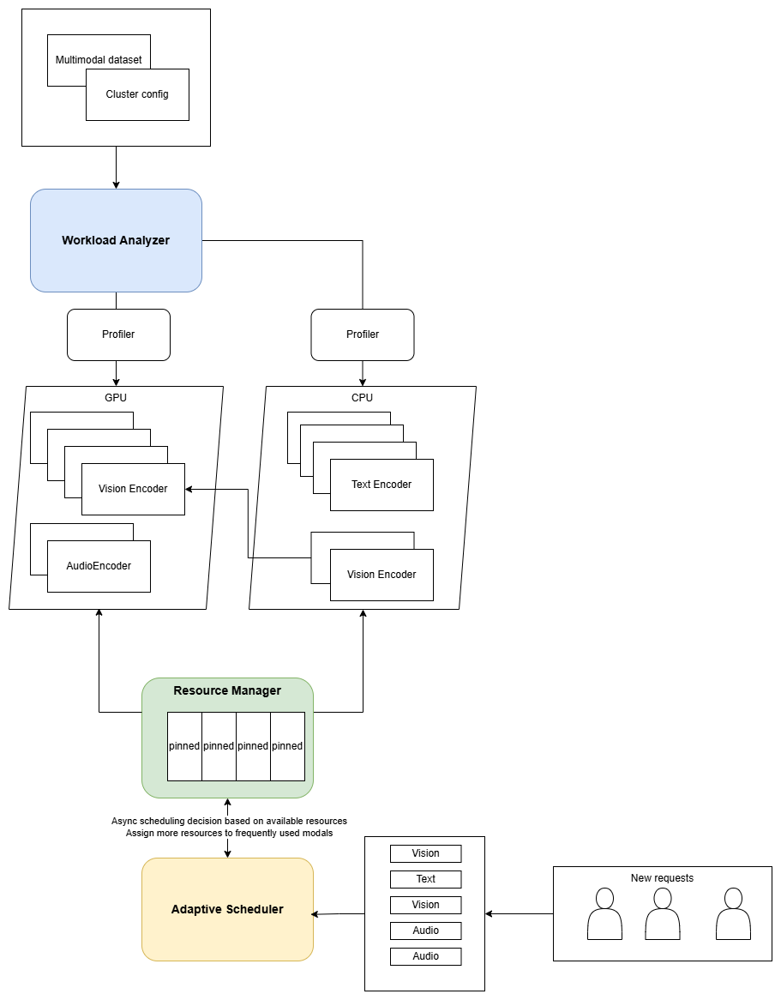

# CSCI596Proposal - Adaptive CPU-GPU Offloading Framework for Multi-Modal AI Models

## 1. Existing Parallelism Strategies for Large Language Models (LLMs)

Large Language Models require enormous computational resources for training and inference due to their massive parameter sizes and extensive input sequences. The following sections explore the primary parallelism techniques that have been optimized for LLMs.

### **1.1. Data Parallelism (DP)**

Data parallelism replicates the full LLM across multiple devices, with each device processing different subsets of the input data in parallel. Gradients are computed independently on each device and then synchronized to ensure consistent model updates. This approach is simple to implement and scales well with increasing numbers of devices. However, each device must store a full copy of the LLM, leading to significant memory usage.

### **1.2. Tensor Model Parallelism (TP)**

Tensor model parallelism divides the LLM’s layers by splitting tensors (e.g., weights, attention heads) across devices. Devices handle parts of the tensor computations and communicate intermediate results for subsequent processing. This method reduces per-device memory usage, enabling larger models to fit into memory. Extensions like 2D Tensor Parallelism, used in PaLM inference, optimize communication for large-scale clusters with more than 256 devices. Hybrid strategies that combine TP with DP also efficiently handle multi-query attention.

### **1.3. Pipeline Model Parallelism (PP)**

Pipeline model parallelism segments the LLM into sequential stages, with each device responsible for a portion of the model's layers. Input data is processed in micro-batches that flow through the pipeline stages in parallel, increasing throughput and making it ideal for batched inference or training. However, this approach does not inherently reduce the latency of processing a single input and may introduce idle time during pipeline execution.

### **1.4. Sequence Parallelism (SP)**

Sequence parallelism splits the processing of long input sequences across devices by dividing the sequence along its length dimension. Each device processes a segment of the sequence, and results are aggregated to construct the final output. This method addresses the memory bottleneck of processing long sequences, enabling LLMs to handle extended contexts efficiently. However, careful handling of inter-segment dependencies and inter-device communication is crucial to its success.

### **1.5. Sub-Graph Parallelism (SGP)**

Sub-graph parallelism partitions the LLM’s computational graph into smaller, manageable sub-graphs assigned to different devices. These sub-graphs are executed concurrently on devices, with synchronization at critical data exchange points. This approach provides flexibility for heterogeneous or irregular computational demands in LLM architectures, but it increases complexity and may require sophisticated scheduling to minimize communication overhead.

## 2. Leveraging CPU Offloading in LLM Training: A Key to Efficient Parallelism

As large language models grow in size and complexity, GPU parallelism alone is often insufficient to handle the computational and memory demands. CPU offloading emerges as a complementary strategy, distributing specific tasks to CPUs to optimize resource utilization, reduce GPU memory pressure, and improve overall system performance. By delegating appropriate tasks to CPUs, LLM training and inference can benefit from the combined strengths of both processing units.
### 2.1 Current state of work
#### 2.1.1 Data Preprocessing Offloading
Recent research has made significant strides in addressing CPU preprocessing bottlenecks in deep learning training. Um et al. [1] introduced FastFlow, which developed an automated decision-making system for offloading preprocessing tasks to remote CPU resources. The system intelligently determines when to offload, which operations to offload, and the optimal amount of data to process remotely, achieving up to 4.34× speedup compared to standard training without offloading.
A complementary approach comes from Kim et al. [2] with FusionFlow, which focuses on CPU-GPU cooperation within a single machine. Through ahead-of-time task allocation, cross-boundary memory sharing, and task affinity-aware scheduling, their system demonstrates 16-285% performance improvement over CPU-only methods without requiring remote resources.

### 2.1.2 CPU Memory Utilization
The field of CPU memory utilization has seen remarkable advances through initiatives like ZeRO-Infinity. Rajbhandari et al. [3] extended the ZeRO optimizer family with novel heterogeneous memory access capabilities. This innovation enables the training of models with tens of trillions of parameters by effectively leveraging CPU and NVMe memory alongside GPU resources. Through bandwidth-centric partitioning and memory-centric tiling techniques, the system achieves up to 40 TFlops/GPU for trillion-parameter models.
Ren et al. [4] took a different approach with ZeRO-Offload, focusing on democratizing billion-scale model training. By offloading optimizer states and computation to CPU memory, their system enables training of models with over 13 billion parameters on a single GPU while maintaining 40 TFlops/GPU performance.

### 2.2 CPU vs. GPU Architectural Comparison
CPUs and GPUs each bring distinct advantages to LLM training. CPUs excel at multi-threaded, branch-intensive tasks and handle irregular memory access patterns more effectively. They provide greater flexibility for general-purpose operations and typically come equipped with larger memory capacity. Most preprocessing libraries are optimized for CPU execution and offer better support for custom operations.
In contrast, GPUs shine in massive parallel processing scenarios, leveraging thousands of CUDA cores for efficient handling of dense parallel tasks like matrix multiplications. Their high-bandwidth memory is optimized for computationally intensive data processing, while specialized hardware like Tensor Cores accelerates matrix and convolution operations. The availability of dedicated libraries such as cuDNN and TensorRT provides optimized implementations for neural network operations.

## 3. CPU Offloading Framework for Multimodal Workloads

we propose a CPU offloading framework for multimodal workloads, achieving better resource utilization and can achieve better effiency with limited resources.

### 3.1. System Architecture and Task Scheduling

In multimodal models, different workloads are computed separately, then go through alignment modules before being fed to a large model backbone (usually a pretrained large language model). This unique architecture presents both challenges and opportunities for CPU offloading.

The proposed framework consists of three main components:

#### Workload Analyzer
Different modalities present distinct challenges: vision processing demands heavy computational resources for convolutions, audio processing requires moderate computation with specific signal processing needs, and text processing, while computationally lighter, has unique memory access patterns for embeddings and sequential processing.

Profiles different types of operations in each modality.
1. Tracks computation intensity and memory access patterns for scheduling decision.
2. Identifies dependencies between modalities and operations.
3. Take both computation and communication into consideration.
4. Finally find the best place for each component or even layer of the model given a fixed number of resources.

#### Resource Manager

1. Monitors CPU/GPU utilization and memory status at runtime.
2. Employs efficient data movement strategies between CPU and GPU memory through concurrent communication and computation operations.
3. Utilize advanced memory management techniques to improve effiency between gpu and cpu:
such as pinned memory to reduce CPU-GPU data transfer overhead and achieves near-linear scaling across GPUs.[4]

#### Adaptive Scheduler
Once we have all the resource data at runtime,
1. Determines optimal placement of operations during computation, balance with different usage scenarios( some scenario video is get processed more, some text is more some videos are more)
2. Coordinates execution across modalities(Use aynschronous scheduling to improve overall throughput, since processing different modalities take differnt time)

[1] T. Um et al., "FastFlow: Accelerating Deep Learning Model Training with Smart Offloading of Input Data Pipeline," PVLDB, 16(5), 2023.

[2] T. Kim et al., "FusionFlow: Accelerating Data Preprocessing for Machine Learning with CPU-GPU Cooperation," PVLDB, 17(4), 2023.

[3] S. Rajbhandari et al., "ZeRO-Infinity: Breaking the GPU Memory Wall for Extreme Scale Deep Learning," SC, 2021.

[4] J. Ren et al., "ZeRO-Offload: Democratizing Billion-Scale Model Training," USENIX ATC, 2021.
<!-- 
#### 3.1.1. Memory Management

 A hierarchical storage system manages data across GPU, CPU, and disk. Frequently accessed weights and activations are stored in GPU memory, medium-priority data in CPU memory, and low-priority or archival data on disk. A dynamic dataflow scheduler optimizes data placement to minimize latency and maximize throughput.

#### 3.1.2. Model Support

 The framework supports diverse models, including text models (GPT, BERT), vision models (CLIP, Stable Diffusion), and audio models (Whisper), enabling seamless multimodal inference pipelines.

#### 3.1.3. Task Decomposition and Scheduling

 Tasks are decomposed into independent subtasks (e.g., text generation, image feature extraction) and executed asynchronously across GPU, CPU, and disk. High-priority weights are preloaded into GPU memory, while lower-priority data is fetched on demand. Intermediate activations are selectively discarded and recomputed when necessary to reduce memory usage.

### 3.2. Compression and I/O Optimization

#### 3.2.1 Weight Compression

 Weights are stored in low-bit formats (e.g., 4-bit or 8-bit), and sparse activation encoding reduces data transfer overhead. Efficient decoding ensures rapid computation during inference.

#### 3.2.2. I/O Optimization

 Techniques such as weight prefetching and batch loading improve bandwidth utilization. High-throughput NVMe SSDs are used for parallel data access and chunked data processing.

### 3.3. Inference Workflow and Integration

#### 3.3.1 Task Allocation and Execution

 Tasks are prioritized and decomposed into modality-specific subtasks. For cross-modal tasks, dependency trees manage the flow of results between modalities. Resources are dynamically allocated based on priority, with GPU handling critical data and CPU or disk managing secondary tasks.

#### 3.3.2. Result Caching and Feature Fusion

 Intermediate results are selectively cached to balance memory usage and computation time. Cross-modal feature mapping integrates data from different modalities, producing accurate multimodal inference results.

### 3.3. Challenges and Future Work

Despite reduced hardware requirements, challenges remain in synchronizing multimodal tasks and optimizing data exchange. Bandwidth limitations, particularly in disk-to-GPU communication, can hinder performance. Adapting the framework to diverse models also requires significant engineering effort. Future work will focus on unified multimodal feature representations, distributed system scalability, and reinforcement learning-based scheduling for dynamic task optimization. -->

